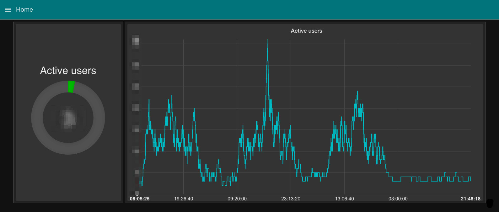

<!-- {}
{} -->

## What is Butler?

Butler is tool that provides add-on features to Qlik Sense.
Some of the features can be used from Sense load scripts, while other provide integration with other systems.

The tool started out as a way of posting to Slack from Qlik Sense load scripts, but has since been generalized and now supports several high level features:

* REST endpoints that can be called from Sense load scripts or external systems.
* Event proxies used to forward messages from Sense's logging framework. In plan English this means sending messages using [Slack](https://slack.com), [MQTT](https://mqtt.org) or email when some event (reload task fail, user logs on, ...) occur in Sense.
* In- and outbound MQTT messages for stable, reliable machine-to-machine communication and notifications.

## What can I use it for?

Sample use cases include:  

* **Information about failing tasks** can be sent to a Slack channel. This gives sysadmins real-time insight into what's happening with respect to task execution.
* **Trigger Sense reload tasks from a reload script**. This makes it possible to start different Sense tasks based on what data has been read from a database, for example.
* **Trigger Sense reloads from external systems**. When new data is available in a source database, immediately trigger reloads of the Sense apps that use that data.
* **Extract metadata about Sense apps**. Exporting an app as JSON can be very useful for backup purposes, or to take regular snapshots of all apps in Sense cluster.
* **Slack messages can include full formatting** (web links, text formatting etc), as well as "poking" users.  
  I.e. notifying specific Slack users that they have a new message. Can for example be used to notify user(s) that an app has reloaded with new data, or that some error condition has occured.
* **Send and receive MQTT publish-subscribe messages**. MQTT (and the pubsub concept in general) is a great way for systems to communicate reliably with each other.
* Modify the Operations Monitor app to **send a daily metrics summary** of daily/weekly/monthly active users, # of failed tasks etc **to a Slack channe**l
* **Real-time monitoring of active users**. This data is posted to MQTT, from where it can be plotted by various tools, see below.
* Butler is fully **open source**, as well as written in a modular and extensible way. It is thus possible to integrate it with most other systems, as well as adding new features if/when needed.

  
Real-time view of # of active users. This particular chart was created by sending metrics via MQTT to a [Node-RED](https://nodered.org) dashboard. While this works well, you might want to take a look at [Butler SOS](https://github.com/ptarmiganlabs/butler-sos) if you are interested in more enterprise grade monitoring of Sense environments. Butler SOS is another open source project from [Ptarmigan Labs](https://ptarmiganlabs.com/).

All Butler project files are available on [GitHub](https://github.com/ptarmiganlabs/butler).

Use the menu to the left to access the different parts of the Butler documentation.

Throughout this documentation the words "Qlik Sense" and "Sense" are used, both referring to the product Qlik Sense from the company Qlik.

Updates to Butler will be published on [GitHub](https://github.com/ptarmiganlabs/butler) and descried on [Ptarmigan Labs'](https://ptarmiganlabs.com/) site.

Good luck and have fun!

## Contributing

Pull requests and stars are always welcome.  
For bugs and feature requests, [please create an issue](https://github.com/ptarmiganlabs/butler/issues/new).
Or fork the project and contribute with enhancements!  

## License

Copyright © 2016-2019 Ptarmigan Labs AB.  
Released under the MIT license.

## Where should I go next?

Ready to move on?  

Great, here are some starting points:

* [Getting Started](/getting-started/): Get started with Butler.
* [Examples](/examples/): Check out some example use cases.

